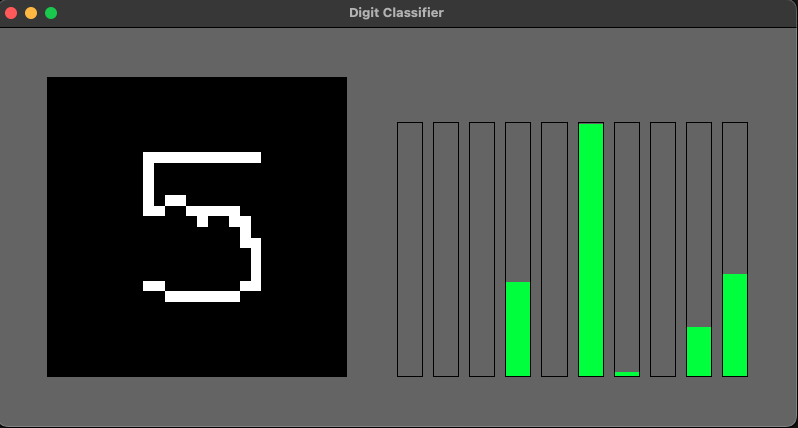

<b>MNIST digit classifier</b>

Built with C++ and SDL2.

Original basic model written in Pytorch.

 
 

Controls:

<ul>
    <li>Clear canvas: c</li>
    <li>Draw on canvas: left mouse</li>
    <li>Randomize canvas: r</li>
    <li>Close: escape</li>
</ul>
 

For setup on mac, ensure SDL2 is installed and run <b>dependencies/setup</b>
